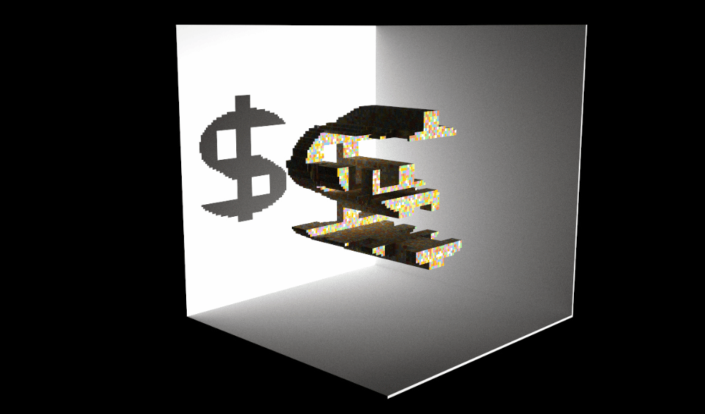
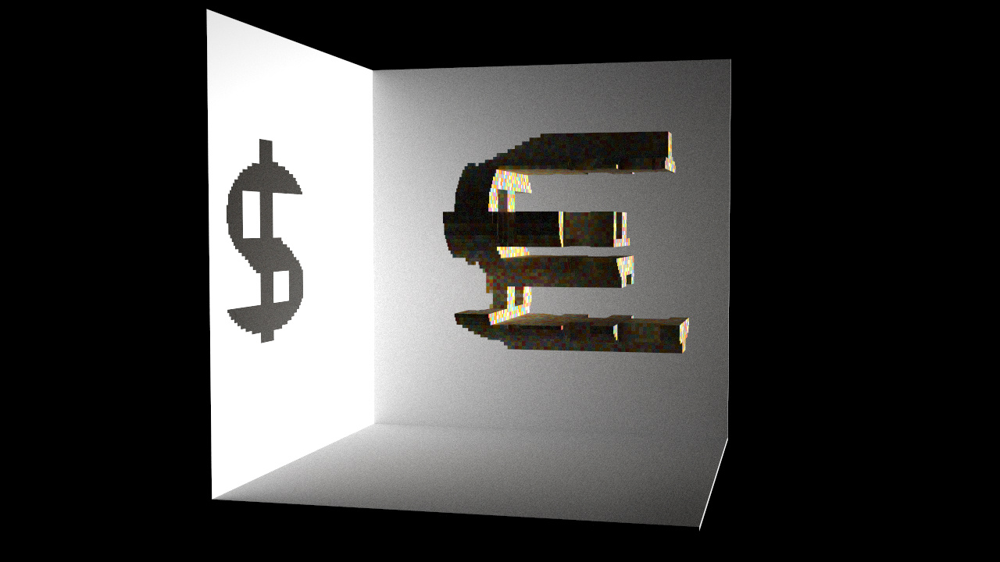
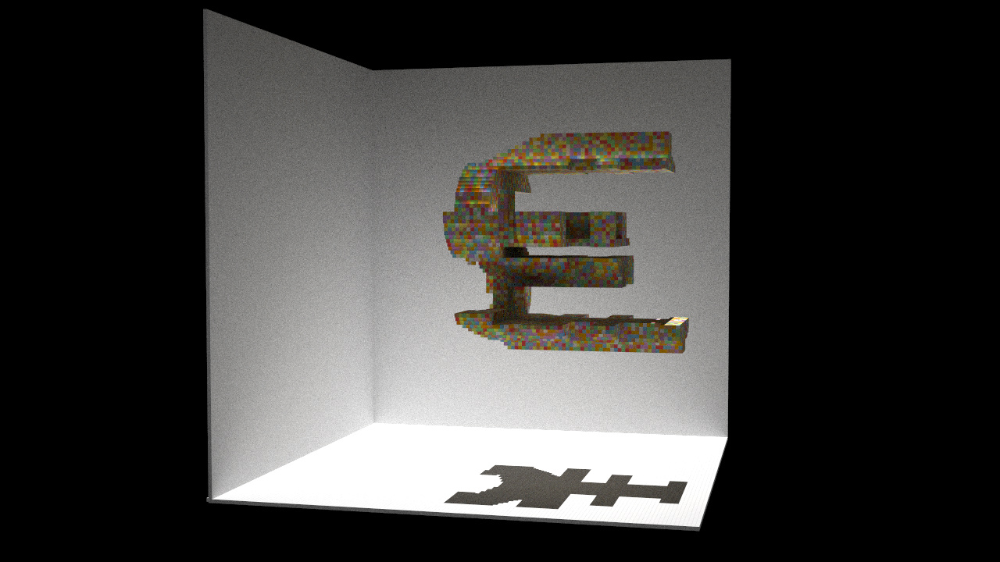
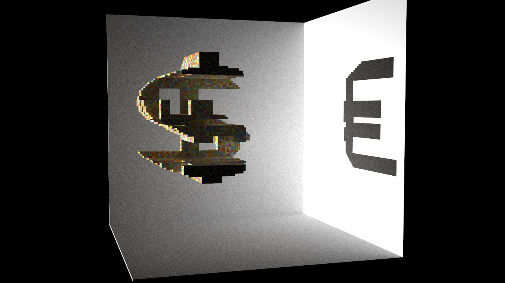
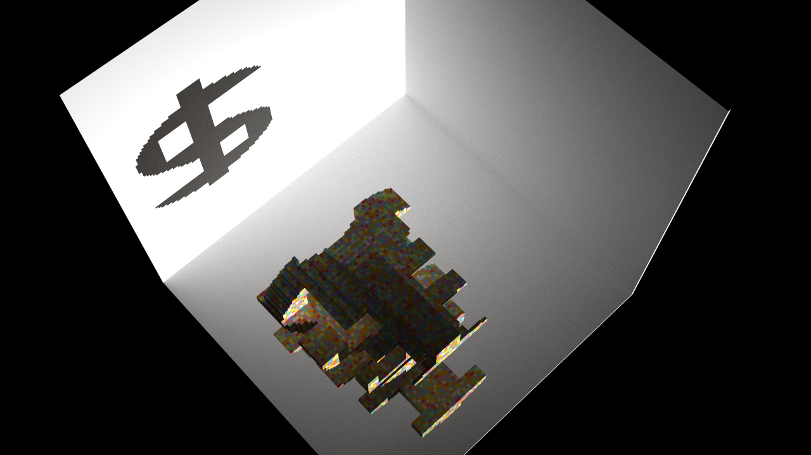

# <a name="title">Projection</a>

<p align="center">
</img>
</p>

> Results of `python3 main.py` in different lighting direction. )

## Meaning
世界是高维的，从来只有立场下的真相。任何事实都是取决于观测矩阵，总有些滤波和投影导致横看成岭侧成峰。
Reality is hidden in the projection and position. 


## Installation

Make sure your `pip` is up-to-date:

```bash
pip3 install pip --upgrade
```

Assume you have a Python 3 environment, simply run:

```bash
pip3 install -r requirements.txt
```

to install the dependencies of the voxel renderer.

## Quickstart

```sh
python3 main.py # example1/2/.../7/8.py
```

Mouse and keyboard interface:

+ Drag with your left mouse button to rotate the camera.
+ Press `W/A/S/D/Q/E` to move the camera.
+ Press `P` to save a screenshot.

## More examples
</img>
</img>
</img>
</img>

## Acknowledge
This artwork is inspired by [Shadow Art](http://graphics.stanford.edu/~niloy/research/shadowArt/shadowArt_sigA_09.html?utm_source=wechat_session&utm_medium=social&utm_oi=985598961864040448). The implementation is based on [The Girl with a Voxel Earring](https://github.com/maajor/maajor-voxel-challenge) and [its related blog](https://mp.weixin.qq.com/s/KzlrWKhli5OwQvw5NrzLoQ).  

